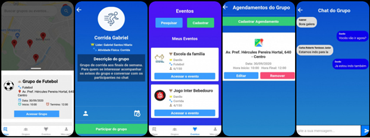

<h3 align="center">
  Projeto BoraPraticar
</h3>

<blockquote align="center">“Aplicação de esportes e atividades físicas para o genreciamento de grupos e equipes dentro das comunidades”!</blockquote>

## ⚙️ Tecnologias utilizadas:

- JavaScript
- React Native
- Styled Components
- Redux
- Node.js
- Mongo DB
- Heroku

## :rocket: Conhecendo a aplicação

Abaixo contém as principais telas do aplicativo.

